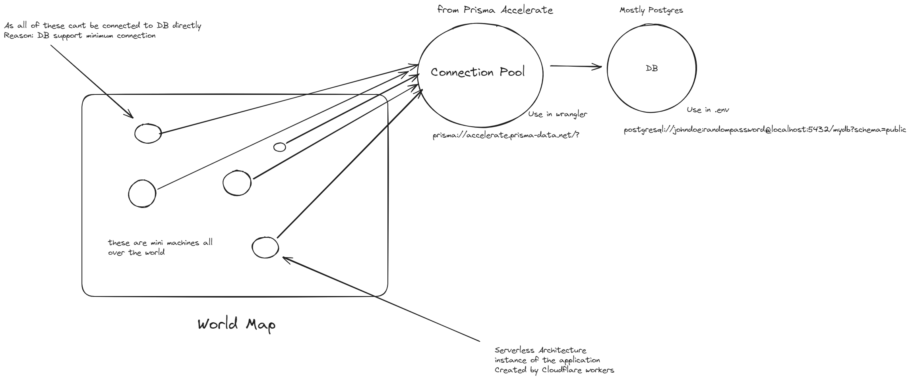

# Blog Application

An open-source application built using Hono, React and everything a production-ready application has.

> [!WARNING]
> This app is a work in progress. I'm building this in public. You can follow the progress on Twitter [@heyy_harshh](https://twitter.com/heyy_harshh).

## About this project

This project is an experiment to see how a modern app (with cloudflare workers, postgres DB, Hono, Prisma, JWT and React) would work in a Production ready application.

## Features

- **React** for Frontend
- **TailwindCSS** for CSS
- **Hono** for Backend
- **Typescript** as Language
- **Postgres** for Database
- **Cloudflare** for serverless functions
- **Prisma** for ORM and connection pool
- **JWT** for authentication
- **Zod** for Validation

## Here is the Journey of this application from scatch

- Initialize using Hono
- Created Handlers for signup, signin, blogs
- Initialize Database using **Neon.tech Postgres** and **Prisma**
- Created Schema for User and Blogs
- Set up **JWT** auth token using **Hono**
- Make Separate Routes for User and Blog
- Tested all Routes and Deployed Backend to Cloudflare
- Added Zod Validation
- deployed NPM package [explained below]

## Why Prisma Accerlerate is Used?

- 

## Why are we using monorepos like in this case we use common?

Here are the list of reasons, with advantages

- Code Reusability (if we dont use the common module, we have to define the type and zod implementation on both frontend and backend)
- Consistency (Suppose you change something in the frontend, you have to do in backend too, else your application will break)

> [!IMPORTANT]
> For frontend we need type or interface
> For backend we need varibles, so we cant directly use a same file
> But in case of Zod, it gives us that benefit, that we can create a a variable and then export it as infer too.

```typescript
//for Backend
export const signupInput = z.object({
    username: z.string();
    password: z.string();
})
//type inference in zod
//for frontend
type SignupParams = z.infer<typeof signupInput>;
```


